# CarShareClient

The **CarShareClient** is the first layer in the CarShare library which exposes public facing APIs. In this layer, the bluetooth connection configuration is constructed using the BLE service UUID extracted from the **CarShareToken**, the **Notify Characteristic UUID**, and the **Write Characteristic UUID**. 

```swift
public func connect(_ carShareToken: String) throws {
    do {
        let carShareToken = try tokenTransformer.transform(carShareToken)
        commandProtocol.delegate = self
        commandProtocol.open(generateConfig(bleServiceUUID: carShareToken.bleServiceUuid))
    } catch {
        print("Failed to decode reservation token")
        throw error
        }
}

private func generateConfig(bleServiceUUID: String) -> BLeSocketConfiguration {
    return BLeSocketConfiguration(
            serviceID: bleServiceUUID,
            notifyCharacteristicID: "430F2EA3-C765-4051-9134-A341254CFD00",
            writeCharacteristicID: "906EE7E0-D8DB-44F3-AF54-6B0DFCECDF1C")
}
```

The **BLeSockectConfiguration** object is passed down to the socket layer which provides a Bluetooth connection context based on the configuration. The CarShareClient implements the **CommandProtocolDelegate** which provides callbacks on initiating a Bluetooth connection, and executing a command.

```swift
func protocolDidOpen(_ protocol: CommandProtocol) {
    delegate?.clientDidConnect(self)
}
```


## Class Diagrams


