# CommandProtocol

The **CommandProtocol** layer provides an abstraction around the commands sent to the GO device and the challange and response flow.

When the **CommandProtocol** layer receives a command message from the **CarShareClient**, the layer goes from a **nil** state to **.requestingToSendMessage** state, the outgoing command is stored in memory and the **appToDeviceMessageRequest** is sent.

```swift
func send(_ message: Message) {
    guard outgoingCommand == nil else {
        return
    }
    guard let commandProto = deviceCommandTransformer.transform(message.command) else {
        return
    }
    outgoingCommand = OutgoingCommand(command: message.command, deviceCommandMessage: commandProto, carShareTokenInfo: message.carShareTokenInfo, state: .requestingToSendMessage)
    transportProtocol.send(appToDeviceMessageRequest)
}
```
Note that commands are only sent if there is not a command currently being executed (outgoingCommand must be nil)

 If the request is sent successfully, the **TransportProtocol's** ```protocolDidSend()``` delegate method get's called and the state transitions to **.waitingForChallenge**.

The GO9’s challenge to the client will be a random array of bytes of length 32 which is received in the protocol(_:didReceive:) delegate function. The ChallengeSigner will use the RSA private key provided to it to sign the challenge bytes using a SHA256 hash. In the final step, a DeviceCommandPayload object is constructed from the signed command hash, the reservation token, and the device command message.

```swift
...
return DeviceCommandPayload.build(from: outgoingCommand.carShareTokenInfo,
                                        commandMessageProto: outgoingCommand.deviceCommandMessage,
                                        signedCommandHash: signedCommandHash).data
...
```
Before sending the payload, the command protocol layer transitions into the .issuingCommand state. Once the payload is sent and protocolDidSend(_:) is called, the command protocol layer transitions into the .awaitingChallengeAck state.

On a successful execution of a command, the GO9 responds with a challenge ack of 0 or a nack otherwise.

```swift
func `protocol`(_ protocol: TransportProtocol, didReceive data: Data) {
...
    case .awaitingChallengeAck:
        self.outgoingCommand = nil
        switch handleAck(data) {
            case .success:
                delegate?.protocol(self, command: outgoingCommand.command, didSucceed: data)
            case .failure(let error):
                delegate?.protocol(self, command: outgoingCommand.command, didFail: error)
            }
}
```


Once the challenge ack is received, we set outgoing command to nil. Also, in the event that an error occurs while processing a command, we fail completely and set the outgoing command to nil.


## Class Diagrams


