# Socket

The **IOSSocket** provides an abstraction for the iOS platform's Core Bluetooth through 
the **Socket** interface.

## Advertising

In the CarShare application, the mobile device acts as a peripheral. Therefore, the function 
```open(_ configuration: BLeSocketConfiguration)``` will add a service with the write and notify characteristics specified in the configuration object and begin advertising.

```swift
func open(_ configuration: BLeSocketConfiguration) {

    guard case .idle = state else {
        return
    }

    peripheral.delegate = self
    let serviceId = CBUUID(string: configuration.serviceID)
    let advertisingData = [
        CBAdvertisementDataServiceUUIDsKey: [serviceId]
    ]

    state = .initializing(
                advertisingData: advertisingData,
                serviceId: serviceId,
                notifyCharacteristicId: CBUUID(string: configuration.notifyCharacteristicID),
                writeCharacteristicId: CBUUID(string: configuration.writeCharacteristicID)
                        )
    peripheralManagerDidUpdateState(peripheral)
}

func peripheralManagerDidUpdateState(_ peripheral: CBPeripheralManager) {

    if peripheral.state == .poweredOff {
        delegate?.socketDidCloseUnexpectedly(self, error: BluetoothOffError())
    }
    guard peripheral.state == .poweredOn else {
        return
    }

    guard case let .initializing(advertisingData, serviceId, notifyCharacteristicId, writeCharacteristicId) = state else {
        return
    }
    let service = CBMutableService(type: serviceId, primary: true)
    let notifyCharacteristic = CBMutableCharacteristic(
        type: notifyCharacteristicId,
        properties: [.notify],
        value: nil,
        permissions: [])
    let writeCharacteristic = CBMutableCharacteristic(
        type: writeCharacteristicId,
        properties: [.writeWithoutResponse],
        value: nil,
        permissions: [.writeable])
    service.characteristics = [notifyCharacteristic, writeCharacteristic]

    state = .advertising(notifyCharacteristic: notifyCharacteristic, writeCharacteristic: writeCharacteristic)
    peripheral.add(service)
    peripheral.startAdvertising(advertisingData)

}

```

## Connect

**CBPeripheralManagerDelegate** provides various callbacks that allow the socket to be notified when
a characteristic has been written to or read from. The **IOSSocket** goes into a connected
state when ```func peripheralManager(_ peripheral: CBPeripheralManager, central: CBCentral, didSubscribeTo characteristic: CBCharacteristic)``` is called.


## Send Data
After a successfull connection has been established with a GO device, the maximum transfer unit (MTU)
is negotiated. The minimum mtu size between the peripheral (mobile device) and the GO device is selected.
This value is stored in the reference to the central object that has subscribed to our iOS device. 

```swift
private var state: State = .idle

var mtu: Int? {
    if case let .connected(_, _, central) = state {
        return central.maximumUpdateValueLength
    } else {
        return nil
    }
}

func peripheralManager(_ peripheral: CBPeripheralManager, central: CBCentral, didSubscribeTo characteristic: CBCharacteristic) {
    guard case let .advertising(notifyCharacteristic, writeCharacteristic) = state else {
        return
    }
    state = .connected(notifyCharacteristic: notifyCharacteristic, writeCharacteristic: writeCharacteristic, central: central)
    peripheral.stopAdvertising()
    delegate?.socketDidOpen(self)
}

```

> The transport protocol layer will chunk data based on the mtu size.

Data is sent to the GO device by writing the data to the notification characteristic.

## Close (disconnect)

Sets state to .idle, stops advertising and removes all published services.

## Class Diagrams


