# TransportProtocol

The **TransportProtocol** uses the Geotab Add-on protocol to establish a connection with the GO9 
and send 3rd party data. 

See [Addon Protocols](https://geotab.github.io/sdk/hardware/addon-protocols/rs232-usb/) for more details

## Class Diagrams

