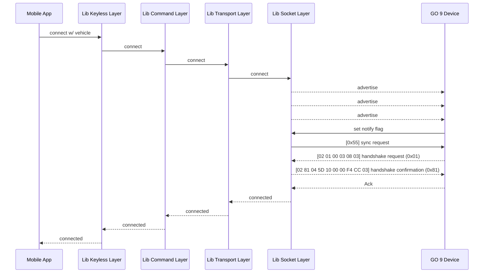
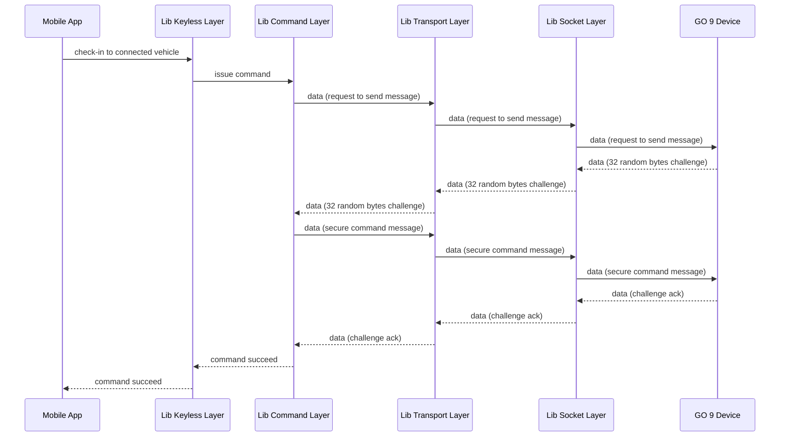

# Keyless Library

## Component Breakdown

### KeylessClient

[More on KeylessClient](KeylessClient.md)

### Command Protocol Layer

[More on CommandProtocol](CommandProtocol.md)

### Transport Protocol Layer

[More on TransportProtocol](TransportProtocol.md)

### Bluetooth Socket Layer

[More on BluetoothSocket](Socket.md)

### Internal Details ###
[Implementation Details](https://docs.google.com/document/d/1URT1blNemftnz8m69trHAaQcPElUxWqyTggJcoEt5Qc/edit?ts=5d5dac59#)  
[Messaging Protocols](https://docs.google.com/document/d/1RAUzXC29UFdBI6u7wDGa1JNkIxm0M8NM0KYPSTcalos/#)

## Sequence Diagrams

### Connect to a Go Device

### Send command to a Go Device

