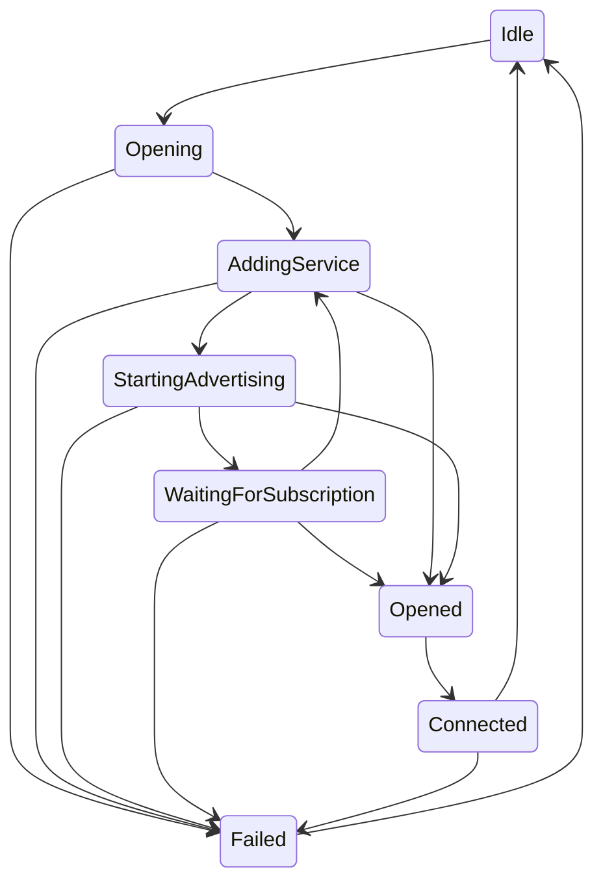

#  Socket State Machine

The bluetooth socket's functions often need to perform several tasks that must be completed in sequence to be successful. Originally, the state was simply tracked with an enum, and `CBPeripheralManagerDelegate` callbacks were handled directly by the `PeripheralManagerSocket`. The callbacks were bogged down by state checks and switch statements. The new design passes the responsibility of handling `CBPeripheralManagerDelegate` callbacks to the current `SocketState`.  The `PeripheralManagerSocket` is not itself a  `CBPeripheralManagerDelegate`.

## State

Each `SocketState` is an internal extension of the `PeripheralManagerSocket` implementation. They are collectively responsible for executing the logic of the socket.

## Managing `CBPeripheralManagerDelegate` Callbacks

Each time the `state` property is set on the `PeripheralManagerSocket`, the `peripheral.delegate` is set to the new state, and the `state.transition()` function is executed. 

## State Diagrams

### Opening and Closing a Connection: `PeripheralManagerSocket.open(...)` and `PeripheralManagerSocket.close()`

Given that the socket is connecting to an external device via Bluetooth, most states have some possibility of the connection failing somehow, or being opened. A typical happy path moves sequentially through each state to `WaitingForSubscription`. When the notify characteristic is subscribed to by a central, the socket transitions to an `Opened` state which calls the delegate, followed immediately by a `Connected` state. When `PeripheralManagerSocket.close()` is executed, the state transitions back to `Idle` where the peripheral is cleared of any outstanding advertisements and services.

The team has observed an issue where a iOS device is silently not advertising and/or not subscribable. To counter that, while in the `WaitingForSubscription` state, after 3 seconds, we remove the service, stop advertising, then transition back to the `AddingService` state.  

